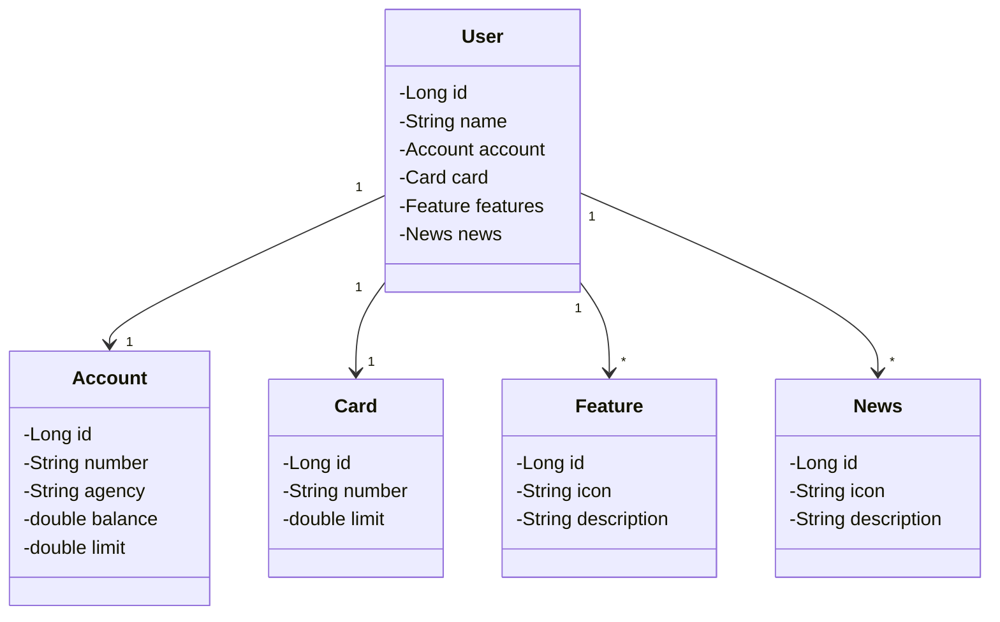

# Bradesco Java Cloud

Java REST-FULL API criada durante Bootcamp Bradesco Java Cloud

## Diagrama de Classes

```mermaid
classDiagram
    class User {
        -Long id
        -String name
        -Account account
        -Card card
        -Feature features
        -News news
    }

    class Account {
        -Long id
        -String number
        -String agency
        -double balance
        -double limit
    }

    class Feature {
        -Long id
        -String icon
        -String description
    }

    class Card {
        -Long id
        -String number
        -double limit
    }

    class News {
        -Long id
        -String icon
        -String description
    }

    User "1" --> "1" Account
    User "1" --> "1" Card
    User "1" --> "*" Feature
    User "1" --> "*" News

```
